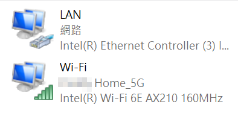

# Switch Ethernet (PowerShell)

A simple script to change the priority of two Network Interfaces (NICs). 

Useful for switching between two networks or change the priority of Ethernet and Wi-Fi.


## :sparkles: Requirements
- Text Editor
- PowerShell
- Only support **Windows**
- Admin Permission
- Basic technical knowledge


## :notebook: How To Use?
1. Open the ps1 file with text editor
2. Open setting / control panel to view the name of both NIC
3. Change the `$net1_name` & `$net2_name` to your NIC's name, change the `$check_ip_url` if you want
4. Create a shortcut to the script `powershell -f <PATH_OF_THE_SCRIPT>` (For example, *`powershell -f "C:\Users\jasonfoknxu\Documents\switch-ethernet.ps1"`*)
5. Right-click the shortcut :arrow_right: Properties :arrow_right: Shortcut (tab) :arrow_right: Advanced :arrow_right: Select **`Run as Administrator`**
6. Execute the script by clicking the shortcut
7. Input `1` to select first network, `2` for the second network, `0` for returning back to default (auto)
8. Done


## :star: Example


There are two networks, the name are `LAN` and `Wi-Fi`

You can select your favorite IP checking server or empty (`$check_ip_url = ""`) to disable IP checking

The config would be like the following:
```powershell
$net1_name = "LAN"
$net2_name = "Wi-Fi" 
$check_ip_url = "https://api.ipify.org"
```


## :gear: How it works?
The script will change the Interface Metric of target NIC to lower, another NIC to higher Metric
